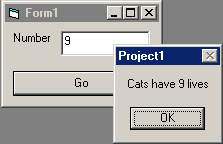

<div align="center">

## Plural Check \(extremely simple, very useful\)


</div>

### Description

I hope I'm not the only person who wants to cringe every time I see something like "You have been online for 1 minutes." 1 minutes?? I see this kind of thing everywhere; here on PSC, even. It looks very unprofessional to me, and it's so easy to fix! That's why I listed this code as beginner level. Hopefully, Planet Source Code will implement this code and I won't have to see that I got an excellent vote from "1 users." ;-) I would like to hear any comments you have about this code. Also, please click to see my other submissions to PSC. My latest program, Music Maker is nearing the top of the Code of the Month list. If I can get a few more votes it would really help me out! :-) Thanks for looking!
 
### More Info
 


<span>             |<span>
---                |---
**Submitted On**   |
**By**             |[Jeremiah Hughes](https://github.com/Planet-Source-Code/PSCIndex/blob/master/ByAuthor/jeremiah-hughes.md)
**Level**          |Beginner
**User Rating**    |5.0 (10 globes from 2 users)
**Compatibility**  |VB 6\.0
**Category**       |[String Manipulation](https://github.com/Planet-Source-Code/PSCIndex/blob/master/ByCategory/string-manipulation__1-5.md)
**World**          |[Visual Basic](https://github.com/Planet-Source-Code/PSCIndex/blob/master/ByWorld/visual-basic.md)
**Archive File**   |[](https://github.com/Planet-Source-Code/jeremiah-hughes-plural-check-extremely-simple-very-useful__1-25593/archive/master.zip)


### Source Code

```
'add a command button and a textbox to your form
Option Explicit
Function PluralCheck(Num, Singular As String, Plural As String) As String
Dim NumString As String
NumString = Trim(Str(Num)) & " "
If Num = 1 Then
 PluralCheck = NumString & Singular
Else
 PluralCheck = NumString & Plural
End If
End Function
Private Sub Command1_Click()
Dim N As Integer
N = Val(Text1.Text)
MsgBox "Cats have " & PluralCheck(N, "life", "lives")
End Sub
```

